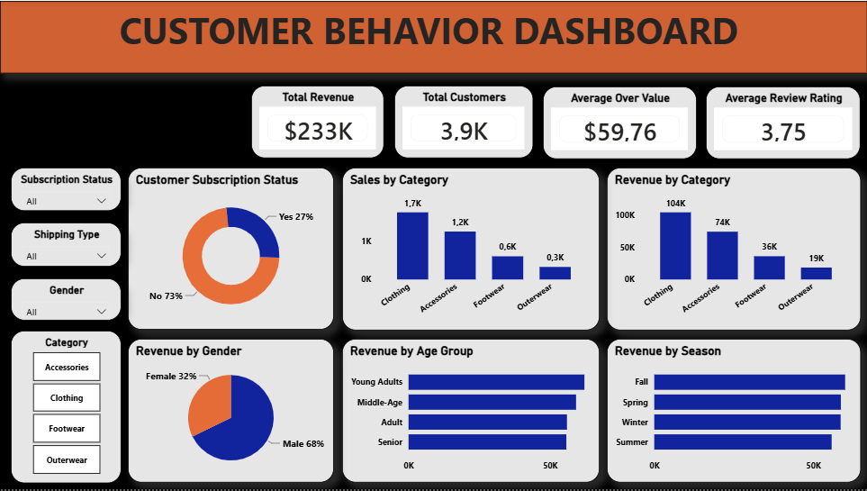

# Customer Shopping Behavior Analysis
## Project Overview
This project analyzes customer shopping behavior to identify purchasing patterns, customer segments, product performance, and subscription trends.

### Objective 
To transform raw customer shopping data into actionable business insights that can support better marketing, customer retention,
and sales decisions using Python/Pandas and SQL, and developed an interactive Power BI dashboard.

## Data Source
**Source:** Kaggle  
**Dataset:** Customer Shopping Behaviour Analysis
**Link:** [Download here](https://www.kaggle.com/datasets/wardabilal/customer-shopping-behaviour-analysis)

## Business Questions
1. What is the total revenue generated by male vs female customers?
2. Which customers used a discount but still spent more than the average amount?
3. Which are the top 5 products with the highest average review rating?
4. Compare the average purchase amounts between standard and express shipping
5. Do subscribed customers spend more? Compare average spent and total revenue between subscribers and non-subscribers.
6. Which 5 products have the highest percentage of purchases with discount applied?
7. Segment customers into New, Returning and Loyal based on their total number of previous purchases and show the count of each segment.
8. What are the top 3 most purchased products within each category?

## Skills Demonstrated

- Data Cleaning & Transformation
- Exploratory Data Analysis (EDA)
- Python & Pandas
- SQL Data Analysis
- Customer Segmentation
- Customer Behavior Analysis
- Ranking & Window Functions
- Aggregation & KPI Development
- Power BI Dashboard Development
- Business Intelligence
- Data Visualization
- Business Insights & Recommendations
   
## Tools Used
- **Python** Data loading, EDA and preprocessing
- **Pandas** Data manipulation and transformation
- **SQL Server** Data storage and querying
- **SQL** Aggregation, segmentation, ranking, and analysis
- **Power BI** Data modeling, visualization and dashboard development

### Project Workflow
Raw Dataset 
     →
Python / Pandas
     →
Exploratory Data Analysis (EDA)
     →
Data Cleaning & Transformation
     →
SQL Server
     →
SQL Data Analysis
     →
Power BI Dashboard
     →
Business Insights

[View Python&Pandas](Customer_Shopping_Behavior.ipynb)

[View SQL Queries](Customer_Behavior.sql)

## Dashboard

### KPI Cards
- Total Revenue: $223.08K
- Total Customers: 39K
- Average Purchase Amount: $59.76
- Average Review Rating: 3.75

### Dashboard Analysis

- Revenue Performance – category, gender and age-group revenue contribution
- Customer Behavior – subscription and customer-segment distribution
- Product Performance – top-rated and frequently purchased products
- Promotion Analysis – discount adoption across products
- Shipping Behavior – comparison of standard vs express customer spending

### Visualizations
- Revenue by Category (Column Chart)
- Revenue by Age Group (Bar Chart)
- Revenue by Gender (Donut Chart)
- Customer Subscription Status (Donut Chart)
- Sales by Category (Column Chart)
- Sales by Age Group (Bar Chart)

## Key Insights

- Clothing and Accessories generated 76% of total revenue, making them the primary drivers of overall sales and key categories for inventory and promotional planning.
- Loyal customers represented 80% of the customer base, while New customers accounted for only 2%, indicating a highly established customer base but a relatively small inflow of new customers. This suggests    an opportunity to strengthen customer acquisition while maintaining loyalty among existing customers.
- Five products received the highest average customer review ratings, indicating strong customer satisfaction with these products.
- Customers using Express Shipping had a slightly higher average purchase amount ($60 vs. $58), indicating a modest association between higher purchase value and express delivery preference.
- Subscription status did not correspond with higher customer spending in this dataset. Non-subscribers generated more total revenue and recorded more repeat purchases than subscribers, suggesting that the     current subscription offering may not be sufficiently compelling to drive higher customer value.
- Five products showed the highest discount usage, providing an opportunity to evaluate promotion effectiveness.
- Fall generated the highest revenue, contributing X% of total sales, indicating stronger customer purchasing activity during the season and an opportunity to increase inventory and promotional planning ahead of peak demand
- Young Adults and Middle-Aged customers contributed the largest shares of revenue, making them important target segments for marketing and customer engagement strategies

Note: Specific findings and recommendations are documented in the SQL analysis and Power BI dashboard.

## Recommendations

- Prioritize Loyal customers and Express Shipping users with targeted offers and personalized marketing campaigns to strengthen engagement and maximize customer value.
- Develop customer retention strategies for repeat and Loyal customers, such as personalized recommendations, loyalty rewards, and exclusive offers.
- Optimize discount and promotional campaigns by focusing promotions on high-performing products and customer segments where discounts are most likely to drive additional purchases.
- Maintain sufficient inventory of high-performing products to meet customer demand and reduce the risk of stock shortages.
- Evaluate subscription benefits, pricing, and incentives to determine why repeat customers are not converting to subscribers.
- Promote exclusive subscriber benefits, such as special discounts, early access to products, loyalty rewards, and enhanced shopping benefits.

## Conclusion
  
This analysis demonstrates how Python, SQL and Power BI can be used to transform customer shopping data into actionable business insights. The analysis identified key revenue-driving categories, customer segments, purchasing behaviors, discount patterns and subscription trends. The findings highlight opportunities to strengthen customer acquisition, retain high-value customers, optimize promotional strategies and improve subscription adoption
